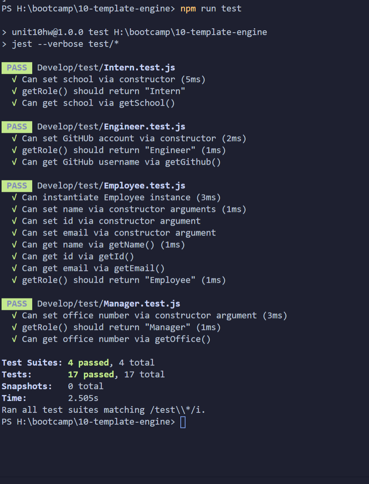

# DALE'S TEMPLATE ENGINE

### TABLE OF CONTENTS

- [CONTRIBUTORS](#CONTRIBUTORS)
- [DESCRIPTION](#DESCRIPTION)
- [REFERENCE LINKS](#REFERENCE-LINKS)
    - [Dale's Template Engine Application :: GitHub Repo](https://github.com/drkittendorf/template-engine)
- [LANGUAGES AND TOOLS](#LANGUAGES-AND-TOOLS)
- [CORE PROJECT TECHNOLOGIES](#CORE-PROJECT-TECHNOLOGIES)
- [CORE NODE DEPENDENCIES](#CORE-NODE-DEPENDENCIES)
- [FUTURE DEVELOPMENT](#FUTURE-DEVELOPMENT)
- [LICENSING](#LICENSING)
- [SCREENSHOTS](#SCREENSHOTS-AND-VIDEO)

---
## CONTRIBUTORS
Dale Kittendorf

 

---

## DESCRIPTION

## USER STORY

*With this application a user will find -
   - a command-line application that accepts user input
   - WHEN a User(Manager) is prompted for informationto build their engineering team. 
   - There are options to add manager, intern and engineer.
   - After the questions are answered a team.html file is generated in the output directory, options for display include Name, ID, Email and Role, as well as speciality categories for each Role.

 

---

## REFERENCE LINKS

Link to **GitHub Repo** used for application development - [Application GitHub Repo](https://github.com/drkittendorf/template-engine)

 

---

## LANGUAGES AND TOOLS:

 
 

---

### CORE PROJECT TECHNOLOGIES

Here is a list of all the core technologies used to develop this application.

- `Node.js - An asynchronous event-driven JavaScript runtime`

### CORE NODE DEPENDENCIES

The dependencies listed below are all the core NPM packages used throughout the project.

- `jest-tests`
- `inquirer`

 

---

## FUTURE DEVELOPMENT

For `future` development, I would like to incorporate the following `enhancements` into template-engine:

- 

---

## LICENSING
  

The code in this project is licensed under MIT license.

---

## SCREENSHOTS AND VIDEO

- ### SCREENSHOT(S)  

(Assets/images/screenshot-successful-npm-run-test.png)
https://github.com/drkittendorf/template-engine/blob/master/Assets/images/screenshot-successful-npm-run-test.png

 

- ### VIDEO
[
https://drive.google.com/file/d/1yGp4G6V1SqPSvravv_NMaYQX8EJTVkJP/preview
https://github.com/drkittendorf/template-engine/blob/master/Assets/images/video-demo.webm
 

---